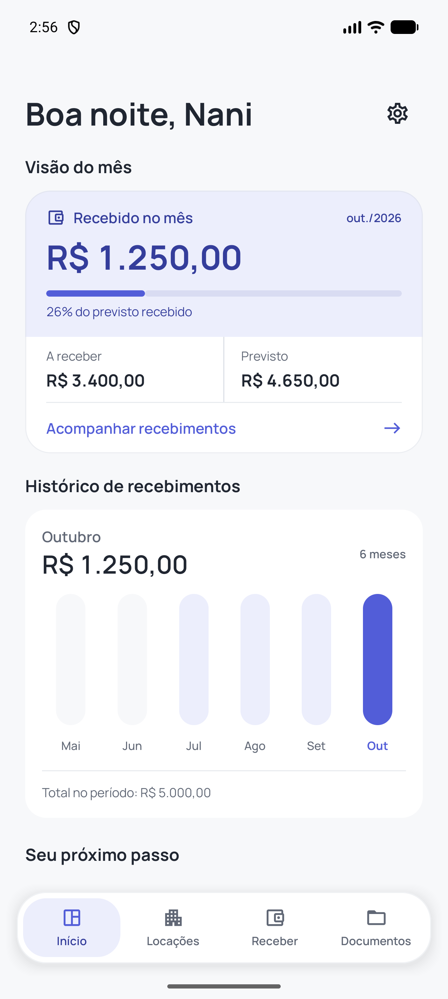
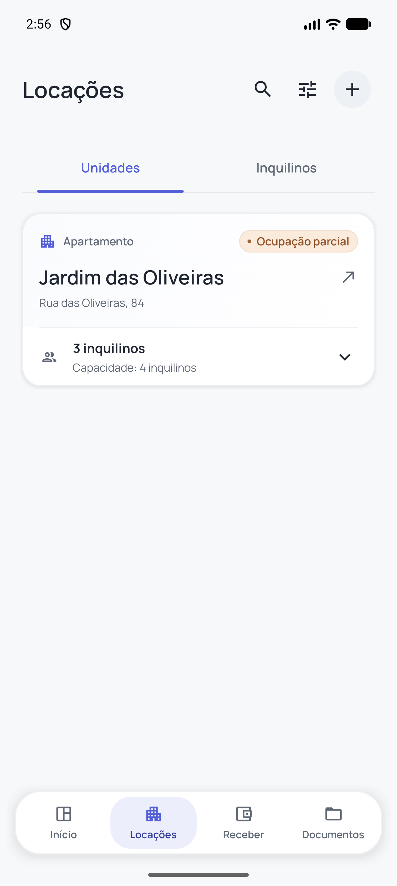
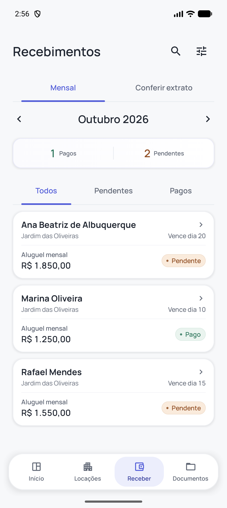

<p align="center"></p>

# Aluguéis Nani

Aplicativo Android para organizar os aluguéis de uma república: moradores, unidades, pagamentos mensais, documentos e lembretes. Desenvolvi o projeto para ajudar minha mãe no acompanhamento desse trabalho diário.

A aplicação funciona localmente, sem conta, servidor ou conexão com a internet. Este repositório apresenta o código, as decisões de arquitetura e os testes; as imagens usam exclusivamente dados fictícios.

[](https://github.com/GabrielAngelimm/alugueis-nani-android/actions/workflows/android.yml)


## O que o aplicativo faz

- **Início:** resumo da competência atual, ocupação, estados de pagamento e histórico estimado de recebimentos.
- **Locações:** cadastro de moradores e unidades, valor do aluguel, vencimento, nomes alternativos e informações de contato.
- **Receber:** controle mensal com pagamentos pendentes, parciais e pagos; conferência de créditos extraídos de PDF ou CSV.
- **Documentos:** anexos de contrato e vistoria, datas de referência e acesso aos arquivos pelo Android.
- **Lembretes:** notificações locais por morador, com antecedência configurável.
- **Backup:** exportação e restauração do formato completo `.nani`, incluindo documentos e configurações; compatibilidade com backups JSON antigos.

Não há cobrança automática nem integração bancária. A conferência de extratos é uma ferramenta de apoio à decisão de quem usa o aplicativo.

## Telas

| Início | Locações | Receber |
| :---: | :---: | :---: |
|  |  |  |

Capturas de testes de interface com banco isolado, sem informações da república real.

## Tecnologias

| Área | Implementação |
| --- | --- |
| Linguagem e concorrência | Kotlin, coroutines, `Flow` e `StateFlow` |
| Interface | Jetpack Compose, Material 3 e fontes locais |
| Organização | MVVM com camadas de apresentação, domínio e dados em um módulo |
| Injeção | Hilt com KSP |
| Persistência | Room e Preferences DataStore |
| Navegação | Navigation Compose com rotas tipadas |
| Arquivos | Storage Access Framework e FileProvider |
| Extratos | PDFBox Android e kotlin-csv |
| Lembretes | AlarmManager e notificações locais |
| Validação | JUnit, testes instrumentados de Room e Compose, Android Lint e GitHub Actions |

As versões estão centralizadas em [`gradle/libs.versions.toml`](gradle/libs.versions.toml). O Gradle Wrapper tem versão e checksum fixados.

## Como executar

### Requisitos

- Android Studio compatível com Android Gradle Plugin **9.0.1**.
- **JDK 17** para o toolchain de compilação.
- Android SDK: plataforma **35** e Build Tools **36.0.0**.
- Dispositivo ou emulador com Android **8.0 / API 26** ou superior.

```sh
git clone https://github.com/GabrielAngelimm/alugueis-nani-android.git
cd alugueis-nani-android
```

Abra a pasta no Android Studio, instale os componentes de SDK solicitados, sincronize o Gradle e execute a configuração `app`. O caminho do SDK pode ser fornecido pelo `local.properties` gerado pelo Studio ou por `ANDROID_HOME`; `local.properties` não entra no Git.

Pelo terminal do Windows:

```powershell
./gradlew.bat assembleDebug
adb -s emulator-5554 install -r app/build/outputs/apk/debug/app-debug.apk
```

No macOS/Linux, use `./gradlew assembleDebug`. Ajuste o serial do dispositivo no comando de instalação, se necessário. Nenhuma chave ou serviço externo precisa ser configurado.

### Validação

```powershell
./gradlew.bat testDebugUnitTest assembleDebug assembleRelease assembleDebugAndroidTest --max-workers=2
./gradlew.bat lintDebug --max-workers=1
```

Os testes instrumentados precisam de um dispositivo de teste. Eles exercitam banco, migrações, backups, arquivos, lembretes e fluxos de interface:

```powershell
./gradlew.bat connectedDebugAndroidTest
```

Use um emulador dedicado para esses testes. No Linux/macOS, substitua `./gradlew.bat` por `./gradlew`. O workflow do GitHub usa um emulador isolado e executa o lint depois que as duas variantes terminam de gerar os arquivos do Hilt.

Consulte [`docs/VALIDATION.md`](docs/VALIDATION.md) para os resultados e as condições da revisão. O APK de debug é gerado em `app/build/outputs/apk/debug/`. A variante release compila sem assinatura de distribuição: chaves, APKs e dados operacionais ficam fora do repositório.

## Estrutura

```text
app/
  schemas/                 # Histórico de schemas do Room (1 a 4)
  src/main/java/com/rentalvalidator/app/
    data/                  # Room, repositórios, backups, arquivos e preferências
    di/                    # Módulos de injeção de dependências
    domain/                # Modelos, contratos e regras de conferência
    presentation/          # Telas Compose, ViewModels, navegação e tema
    reminders/             # Agendamento e recebimento de lembretes
    util/                  # Datas, moeda e leitura de extratos
  src/test/                # Testes JVM
  src/androidTest/         # Testes Android e fixtures fictícias
brand/                     # Identidade do aplicativo
docs/                      # Arquitetura, revisão e validação
scripts/                   # Verificação dos arquivos destinados à publicação
gradle/                    # Wrapper e catálogo de versões
.github/                   # CI e Dependabot
```

## Limites atuais

- PDFs precisam conter texto; não há OCR. Layouts de extrato e nomes ambíguos exigem conferência humana.
- Os pagamentos armazenam o **estado por morador, ano e mês**, sem um livro-caixa de valores, datas ou transações. Totais e gráficos usam o aluguel atual como estimativa.
- Lembretes são locais e inexatos; dependem da permissão de notificações e das restrições do Android.
- O backup completo contém dados pessoais e documentos, **sem criptografia**. Guarde-o em local privado. O JSON antigo não transporta os anexos.
- Este é um projeto pessoal de portfólio. A publicação do código não equivale a uma versão assinada ou distribuída pela Play Store.

## Documentação

- [Arquitetura e decisões](docs/ARCHITECTURE.md)
- [Escopo do produto](PRODUCT.md) e [identidade visual](DESIGN.md)
- [Revisão técnica e dívida restante](docs/REVIEW.md)
- [Resultados de validação](docs/VALIDATION.md)
- [Contribuição](CONTRIBUTING.md), [segurança](SECURITY.md) e [avisos de terceiros](THIRD_PARTY_NOTICES.md)

## Licença

Ainda não há uma licença de reutilização adicionada para o código autoral. A disponibilização pública permite consultar o projeto; consulte o autor antes de reutilizá-lo. Fontes e bibliotecas mantêm suas próprias licenças, descritas nos [avisos de terceiros](THIRD_PARTY_NOTICES.md).
