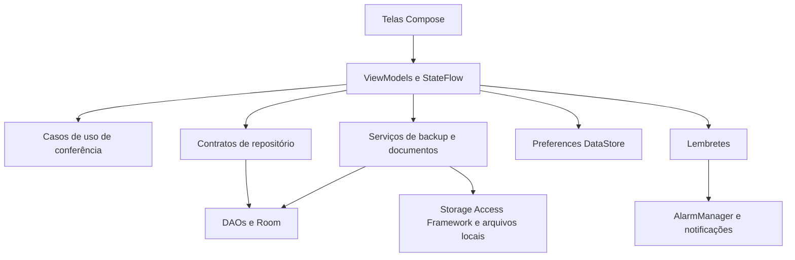

# Arquitetura

O projeto usa MVVM em um módulo Android. As pastas distinguem apresentação, domínio e dados; trata-se de uma separação prática de responsabilidades, sem prometer uma arquitetura Clean estrita ou módulos independentes.

Hilt fornece banco, repositórios, preferências e serviços. A navegação usa rotas serializáveis do Navigation Compose. A interface coleta estados dos ViewModels e apresenta os erros das operações; as confirmações de gravação ocorrem depois da conclusão da persistência.

## Persistência

O Room mantém moradores, unidades e estados de pagamento. O schema atual é a versão 4 e o histórico exportado de 1 a 4 está em `app/schemas/`. Os testes abrem bancos históricos e executam as migrações de produção.

- O pagamento tem chave única de morador/ano/mês e sua atualização preserva o ID.
- O cadastro do morador usa `Upsert`, preservando o histórico vinculado durante atualizações.
- A listagem de unidades e a contagem de moradores vêm da mesma consulta observável.
- Renomear uma unidade também atualiza o nome legado nos moradores, em uma transação.
- Excluir uma unidade verifica sua ocupação dentro da transação.

O vínculo de unidade ainda não tem uma foreign key no schema histórico. As transações reduzem inconsistências nos fluxos normais, mas a evolução dessa restrição exige uma migração própria. O campo textual legado continua necessário à compatibilidade dos dados.

## Regras financeiras

`ValidatePaymentsUseCase` recebe moradores, extrato, competência e configurações de multa/juros. Ele filtra créditos do período, normaliza nomes e aliases e aplica as regras existentes de correspondência e tolerância.

Um estado registrado no banco não contém o valor recebido nem a data efetiva. O histórico da tela Início filtra ano e mês corretamente, incluindo a passagem de dezembro para janeiro, e usa o aluguel atual como estimativa. Dinheiro ainda é representado por `Double`; uma mudança para centavos ou decimal deve incluir contratos de importação, persistência, arredondamento e testes financeiros.

## Arquivos e backups

`DocumentStorage` executa cópias em IO, usa nomes opacos próprios, limita tamanho e restringe remoções ao diretório de anexos. A referência só é gravada depois de uma cópia completa. Se o banco rejeitar a alteração, a cópia nova é removida. A abertura externa usa FileProvider.

`LegacyBackupService` concentra o JSON histórico fora do ViewModel: versões 1 a 4, leitura limitada a 16 MiB, validação de identificadores, competências e referências, e substituição transacional das tabelas. O serviço preserva os campos compatíveis do formato antigo.

`CompleteBackupService` cuida do formato ZIP `.nani`: manifesto versionado, tabelas, preferências, lembretes e anexos, com hashes SHA-256 e limites de importação. Validações de nomes e caminhos impedem extração fora do destino. O rollback após uma substituição do banco também é executado quando a coroutine é cancelada.

Room, DataStore, arquivos e AlarmManager não compartilham uma transação única. O rollback testado cobre falhas e cancelamento cooperativo; interrupção abrupta do processo pode exigir recuperação adicional. Hashes verificam integridade, sem autenticar a origem nem criptografar o conteúdo.

## Lembretes

Configurações de lembretes são persistidas localmente e reconciliadas com AlarmManager, inclusive após eventos de sistema. O cálculo considera vencimento, fuso e antecedência. O armazenamento ignora registros inválidos e preserva versões futuras desconhecidas. O agendamento inexato evita depender da permissão de alarmes exatos; a entrega continua sujeita às restrições do Android.

## Build e testes

O catálogo Gradle centraliza versões; o Wrapper fixa Gradle 9.1.0 e seu checksum. O toolchain compila com Java/Kotlin 17. Debug e release usam os mesmos dados e regras; release permanece sem assinatura configurada e com minificação desativada.

Os testes JVM cobrem regras, normalização, moeda, datas e histórico mensal. Os testes instrumentados exercitam Room, migrações, backups, arquivos, lembretes e Compose em bancos de teste. Consulte [VALIDATION.md](VALIDATION.md) para o resultado efetivamente observado.

Referências: [migrações do Room](https://developer.android.com/training/data-storage/room/migrating-db-versions), [cancelamento de coroutines](https://kotlinlang.org/docs/cancellation-and-timeouts.html) e [requisitos do AGP 9.0](https://developer.android.com/build/releases/agp-9-0-0-release-notes).
